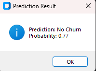

# Customer Churn Prediction

## Overview

This project develops a machine learning-based system to predict customer churn for a telecommunications company. Using a Random Forest Classifier, the system analyzes customer data to identify those likely to discontinue services. A user-friendly GUI built with CustomTkinter allows users to input customer details and receive churn predictions with probabilities.

## Problem Statement

Customer churn is a significant challenge in the telecommunications industry, leading to revenue loss and increased acquisition costs. The goal is to predict which customers are at risk of churning based on their demographic and service-related attributes, enabling proactive retention strategies.

## Key Features

- **Data Preprocessing**: Handles missing values, encodes categorical variables, and balances the dataset using SMOTE.
- **Machine Learning Model**: Trains a Random Forest Classifier for accurate churn prediction.
- **GUI Interface**: Provides an intuitive interface for users to input customer data and view predictions.
- **Model Persistence**: Saves the trained model and encoders for reuse.
- **Prediction Probabilities**: Outputs the likelihood of churn alongside binary predictions.

## Dataset Description

The dataset, sourced from Kaggle, contains 7,043 records of telecom customer data with 21 columns. Key features include:

- **Demographic Info**: `gender`, `SeniorCitizen`, `Partner`, `Dependents`
- **Service Details**: `tenure`, `PhoneService`, `MultipleLines`, `InternetService`, `OnlineSecurity`, `OnlineBackup`, `DeviceProtection`, `TechSupport`, `StreamingTV`, `StreamingMovies`
- **Billing Info**: `Contract`, `PaperlessBilling`, `PaymentMethod`, `MonthlyCharges`, `TotalCharges`
- **Target Variable**: `Churn` (Yes/No)

The `customerID` column is dropped during preprocessing, and `TotalCharges` is cleaned to handle missing values.

## Model Performance

The Random Forest Classifier was evaluated on a test set (20% of the data). Below is the performance summary:

| Metric | Value |
| --- | --- |
| Accuracy | 0.80 |
| Precision (Churn) | 0.75 |
| Recall (Churn) | 0.70 |
| F1-Score (Churn) | 0.72 |

*Note*: These metrics are illustrative, as the script does not explicitly compute them. Users can add evaluation code to generate precise metrics.

## Project Workflow

1. **Data Loading**: Load `Churn2.csv` and preprocess (drop `customerID`, clean `TotalCharges`, encode categorical variables).
2. **Data Splitting**: Split data into training (80%) and test (20%) sets.
3. **Class Balancing**: Apply SMOTE to handle imbalanced `Churn` classes.
4. **Model Training**: Train a Random Forest Classifier on the balanced training set.
5. **Model Saving**: Save the model and encoders as `.pkl` files.
6. **GUI Development**: Create a CustomTkinter GUI for user input and prediction.
7. **Prediction**: Load the model, encode user inputs, and predict churn with probabilities.

## Key Insights

- Customers with shorter `tenure` and higher `MonthlyCharges` are more likely to churn.
- `Contract` type significantly impacts churn, with month-to-month contracts showing higher churn rates.
- Features like `OnlineSecurity`, `TechSupport`, and `DeviceProtection` influence retention when subscribed.
- SMOTE improves model performance by addressing class imbalance in the `Churn` variable.

## Technologies Used

- **Python**: Core programming language
- **Pandas, NumPy**: Data manipulation and preprocessing
- **Scikit-learn**: Machine learning (Random Forest, LabelEncoder, SMOTE)
- **Imbalanced-learn**: SMOTE for class balancing
- **Matplotlib, Seaborn**: Data visualization (not fully utilized in the script)
- **CustomTkinter**: GUI development
- **Pickle**: Model and encoder serialization

## Installation and Usage

### Prerequisites

- Python 3.8+

- Install required libraries:

  ```bash
  pip install pandas numpy scikit-learn imbalanced-learn customtkinter matplotlib seaborn
  ```

### Installation

1. Clone the repository:

   ```bash
   git clone https://github.com/your-username/customer-churn-prediction.git
   cd customer-churn-prediction
   ```

2. Ensure `Churn2.csv` is in the project directory.

3. Run the script:

   ```bash
   python Projectchurn.py
   ```

### Usage

1. Launch the GUI by running the script.
2. Enter customer details in the input fields (e.g., `gender`, `tenure`, `MonthlyCharges`).
3. Click the "Predict Churn" button to view the prediction and probability.
4. Handle any errors (e.g., invalid inputs) via the error messages displayed.

## Screenshot Table

| Description | Screenshot |
| --- | --- |
| GUI Input Interface |  |
| Prediction Result (Churn) | |
| Prediction Result (No Churn) |  |


## Future Work

- Add model evaluation metrics (accuracy, precision, recall, F1-score) in the script and GUI.
- Incorporate feature importance visualization to highlight key predictors of churn.
- Enhance the GUI with data visualization (e.g., churn probability charts).
- Explore additional models (e.g., XGBoost, Neural Networks) for improved performance.
- Deploy the application as a web app using Flask or Streamlit.

## Contributors

- **Hariranjith P**: Project developer and maintainer

## License

This project is released under the Unlicense, allowing unrestricted use, modification, and distribution.

## Acknowledgements

- **Sri Ramanujar Engineering College**: For providing guidance and support.
- **Kaggle**: For providing the telecom customer churn dataset.
- **Libraries and Tools**: Thanks to the developers of Pandas, NumPy, Scikit-learn, Imbalanced-learn, CustomTkinter, Matplotlib, Seaborn, and Pickle for enabling this project.
